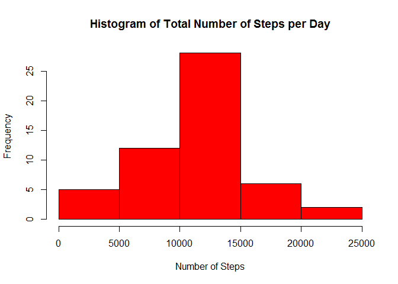
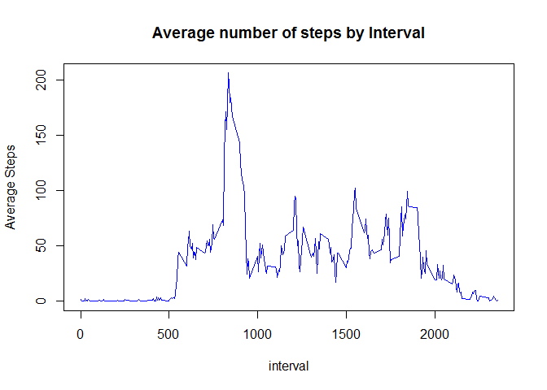
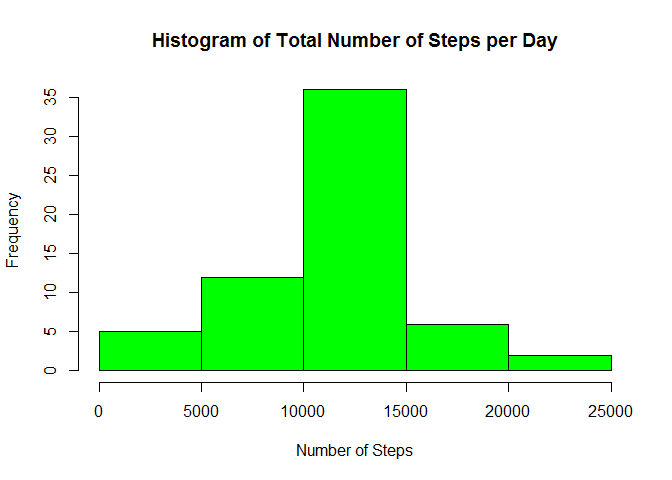
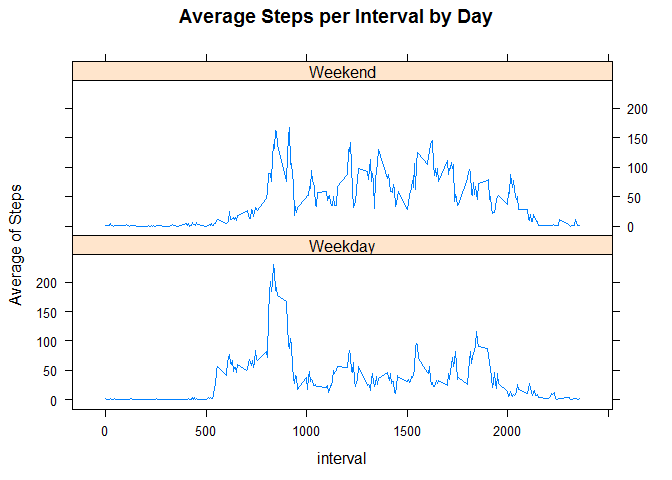

# Reproducible Research Project 1
Srikanth Balaraman  
August 27, 2016  

### About
This is the first project for the Reproducible Research course. The purpose of the project is to analyze the activity data generated by a device and answer questions.The data for this project was provided in the course website.


### Loading and preprocessing the data
No Transformation of the data required


```r
unzip("activity.zip")
fulldata<- read.csv("activity.csv")
```
### Q1) What is mean total number of steps taken per day?
Summarize the data to get total number of steps in day, create Histogram, and calculate mean and median of steps.  
For this exercise, missing values were ignored


```r
library(dplyr)
options(scipen=1)
data<- na.omit(fulldata)
sumsteps<- summarise(group_by(data,date), steps=sum(steps, na.rm = T))
hist(sumsteps$steps,col="red",main="Histogram of Total Number of Steps per Day",xlab="Number of Steps")
```

<!-- -->

```r
stepmean<- round(mean(sumsteps$steps))
stepmed<- median(sumsteps$steps)
```

The mean of steps per day is 10766 and the median of steps per day is 10765.

### Q2) What is the average daily activity pattern?
Summarize the data to get total number of steps by 5 minute interval, create time series plot, and find which 5 minute interval contains maximum number of steps.


```r
sumstepsint<- summarise(group_by(data,interval), steps=mean(steps, na.rm = T))
with(sumstepsint,plot(interval,steps,type="l",ylab="Average Steps",main="Average number of steps by Interval", col="blue"))
```

<!-- -->

```r
intmaxsteps<- sumstepsint$interval[which.max(sumstepsint$steps)]
maxsteps<- round(max(sumstepsint$steps),0)
```

The interval 835 has the maximum number of steps with 206 steps.

### Q3) What is the impact of imputing missing data on the estimates of the total daily number of steps?
Identify the number of rows and the index of the rows with missing values. Make a copy of the fulldata and substitute the number of missing steps with the mean of steps for that interval.  
Create histogram of total number of steps and check if the mean and median of the steps differ from the values in Q1.


```r
totmissrows<- sum(is.na(fulldata$steps))
narows<- which(is.na(fulldata$steps))
matchr<- match(fulldata$interval[narows],sumstepsint$interval)
moddata<- fulldata
moddata$steps[narows]<- sumstepsint$steps[matchr]

sumstepsmod<- summarise(group_by(moddata,date), steps=sum(steps, na.rm = T))
hist(sumstepsmod$steps,col="green",main="Histogram of Total Number of Steps per Day",xlab="Number of Steps")
```

<!-- -->

```r
stepmeanmod<- round(mean(sumstepsmod$steps))
stepmedmod<- round(median(sumstepsmod$steps))
```
The number of rows with missing value from original dataset is 2304.  
The mean of steps per day after imputing missing values is 10766.  
The median of steps per day after imputing missing values is 10766.  
The mean is the same as the one in Q1 and the median differs just by 1. Hence there is no impact by imputing missing values.

### Q4) Are there differences in activity patterns between weekdays and weekends?
Convert the date variable to date format using as.POSIXct. Add a new factor with values as "Weekday" and "Weekend".  
Summarise the data to get average number of steps per interval by day.  
Plot a time series plot to analyse the data.

```r
moddata$date<- as.POSIXct(moddata$date,"%Y-%m-%d")
moddata<- mutate(moddata,day=factor(ifelse(weekdays(date) %in% c("Saturday","Sunday"),"Weekend","Weekday")))

sumstepsday<- summarise(group_by_(moddata,.dots=c("interval","day")), steps=mean(steps))
library(lattice)
with(sumstepsday,xyplot(steps~interval|day,layout=c(1,2),type="l",ylab="Average of Steps",main="Average Steps per Interval by Day"))
```

<!-- -->

The average number of steps on weekday is higher in the morning hours and the average number of steps on weekend is higher afternoon.
